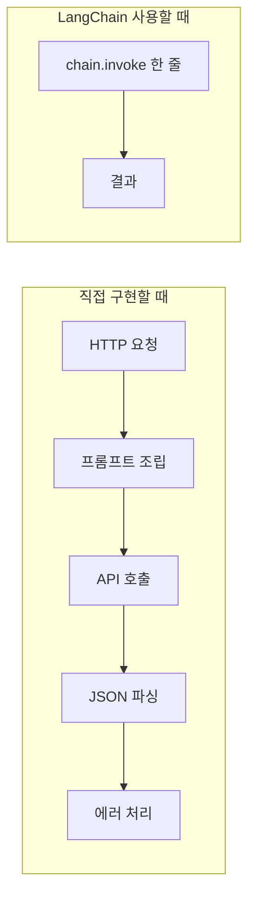
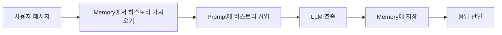
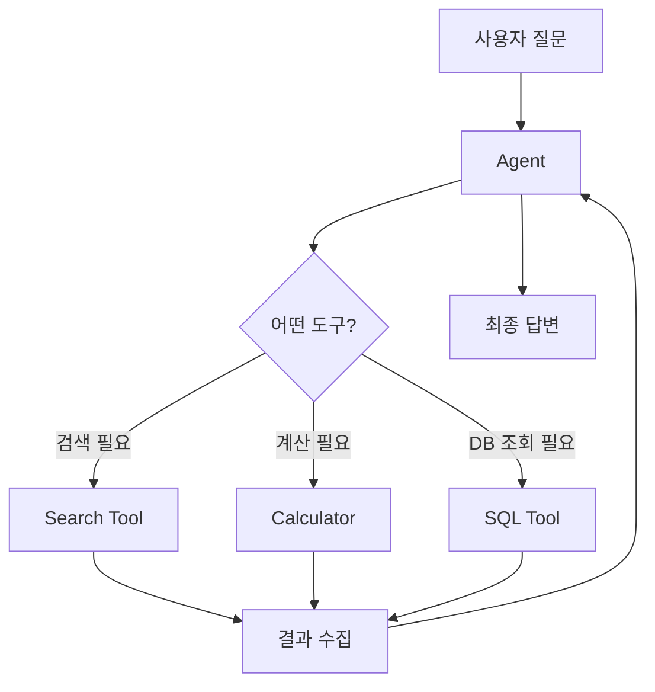

# LangChain — 상세 정리

## 목차
1. [왜 LangChain인가?](#1-왜-langchain인가)
2. [LCEL — 파이프 연산자로 조립하기](#2-lcel)
3. [Prompt Template](#3-prompt-template)
4. [Output Parser](#4-output-parser)
5. [Memory — 대화 기억하기](#5-memory)
6. [Tool & Agent](#6-tool--agent)

---

## 1. 왜 LangChain인가?

LLM 단독으로는 "질문 → 답변"만 가능해요.  
실제 앱은 **데이터 읽기 → 가공 → LLM 호출 → 결과 저장** 같은 복잡한 흐름이 필요해요.  
LangChain은 이 각 단계를 표준화된 블록으로 제공하고, `|` 기호 하나로 연결하게 해줘요.


---

## 2. LCEL

LCEL(LangChain Expression Language)은 블록을 `|` 로 연결하는 문법이에요.
```python
chain = prompt | llm | output_parser
result = chain.invoke({"topic": "Vector DB"})
```

### 스트리밍도 가능
```python
for chunk in chain.stream({"topic": "Vector DB"}):
    print(chunk, end="", flush=True)
```

### 병렬 실행
```python
from langchain_core.runnables import RunnableParallel

parallel_chain = RunnableParallel({
    "summary": summary_chain,
    "keywords": keyword_chain
})
result = parallel_chain.invoke({"text": "..."})
# result = {"summary": "...", "keywords": "..."}
```

---

## 3. Prompt Template

LLM에 전달할 프롬프트를 변수로 관리하는 틀이에요.
```python
from langchain_core.prompts import ChatPromptTemplate

prompt = ChatPromptTemplate.from_messages([
    ("system", "너는 {role} 전문가야. 친절하게 설명해줘."),
    ("human", "{question}")
])

# 변수 채워서 확인
filled = prompt.invoke({"role": "Python", "question": "리스트 컴프리헨션이 뭐야?"})
print(filled)
```

---

## 4. Output Parser

LLM 응답을 원하는 형태로 변환해요.
```python
from langchain_core.output_parsers import StrOutputParser, JsonOutputParser

# 문자열로 받기
chain = prompt | llm | StrOutputParser()

# JSON으로 받기 (구조화된 출력)
chain = prompt | llm | JsonOutputParser()
result = chain.invoke({"question": "파이썬 장단점을 JSON으로 알려줘"})
# result = {"장점": [...], "단점": [...]}
```

---

## 5. Memory

LLM은 기본적으로 이전 대화를 기억하지 못해요.  
Memory가 대화 기록을 관리하고 프롬프트에 자동으로 넣어줘요.

```python
from langchain_community.chat_message_histories import ChatMessageHistory
from langchain_core.runnables.history import RunnableWithMessageHistory

store = {}

def get_history(session_id: str):
    if session_id not in store:
        store[session_id] = ChatMessageHistory()
    return store[session_id]

chain_with_memory = RunnableWithMessageHistory(
    chain,
    get_history,
    input_messages_key="input",
    history_messages_key="history"
)

# 같은 session_id면 대화를 기억함
chain_with_memory.invoke(
    {"input": "내 이름은 민준이야"},
    config={"configurable": {"session_id": "user-1"}}
)
chain_with_memory.invoke(
    {"input": "내 이름이 뭐야?"},
    config={"configurable": {"session_id": "user-1"}}
)
# → "민준이라고 하셨습니다."
```

---

## 6. Tool & Agent

Agent는 LLM이 **스스로 어떤 도구를 쓸지 결정**하는 패턴이에요.

```python
from langchain_core.tools import tool
from langchain.agents import create_tool_calling_agent, AgentExecutor

@tool
def get_weather(city: str) -> str:
    """도시의 날씨를 조회합니다."""
    return f"{city}의 날씨는 맑음, 22도입니다."

tools = [get_weather]
agent = create_tool_calling_agent(llm, tools, prompt)
executor = AgentExecutor(agent=agent, tools=tools, verbose=True)

executor.invoke({"input": "서울 날씨 알려줘"})
```

---

## 참고 링크
- [공식 문서](https://python.langchain.com)
- [LangSmith — 디버깅 도구](https://smith.langchain.com)
- [overview 보기](./overview.md)
