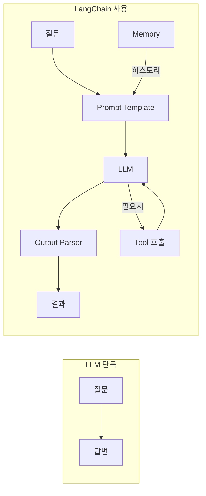
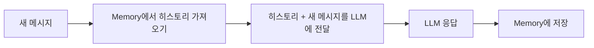
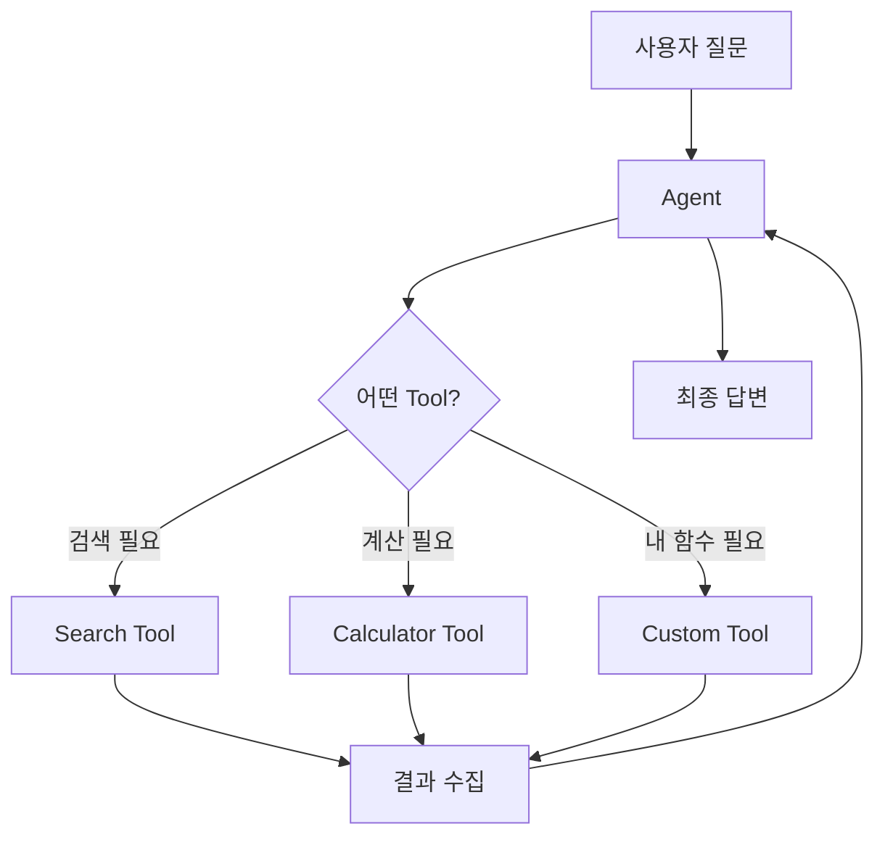

# LangChain — 상세 정리

## 목차
1. [왜 LangChain인가?](#1-왜-langchain인가)
2. [Prompt Template](#2-prompt-template)
3. [LLM 블록](#3-llm-블록)
4. [Output Parser](#4-output-parser)
5. [Memory](#5-memory)
6. [Agent & Tool](#6-agent--tool)

---

## 1. 왜 LangChain인가?

LLM은 기본적으로 세 가지 한계가 있어요.

- **기억이 없다** — 대화가 끝나면 다 잊어버림
- **최신 정보가 없다** — 학습 데이터 이후 세상을 모름
- **행동을 못 한다** — 말만 하고 직접 검색하거나 파일을 못 열음

LangChain은 이 세 가지를 전부 해결해요.


---

## 2. Prompt Template

LLM에 전달할 프롬프트를 **변수로 관리**하는 틀이에요.
`{중괄호}` 안이 변수 자리예요.
```python
from langchain_core.prompts import ChatPromptTemplate

prompt = ChatPromptTemplate.from_messages([
    ("system", "너는 {role}이야."),   # AI 역할/성격 설정
    ("human",  "{question}")           # 실제 사용자 질문
])

chain = prompt | llm | output_parser
result = chain.invoke({
    "role": "친절한 Python 선생님",
    "question": "리스트 컴프리헨션이 뭐야?"
})
```

---

## 3. LLM 블록

어떤 모델이든 **같은 인터페이스**로 사용할 수 있어요.
모델을 바꿔도 나머지 코드는 한 글자도 안 바뀌어요.
```python
from langchain_openai import ChatOpenAI
from langchain_anthropic import ChatAnthropic

# GPT 사용
llm = ChatOpenAI(model="gpt-4o-mini")

# Claude로 교체 — 이 한 줄만 바꾸면 끝
llm = ChatAnthropic(model="claude-haiku-4-5-20251001")

# 나머지 코드는 완전히 동일
chain = prompt | llm | output_parser
```

---

## 4. Output Parser

LLM 응답(항상 텍스트)을 **원하는 형태로 변환**해요.
```python
from langchain_core.output_parsers import StrOutputParser, JsonOutputParser

# 문자열로 받기 (가장 많이 씀)
chain = prompt | llm | StrOutputParser()
result = chain.invoke({...})
# result = "RAG는 ..."

# JSON으로 받기
chain = prompt | llm | JsonOutputParser()
result = chain.invoke({...})
# result = {"장점": [...], "단점": [...]}
```

---

## 5. Memory

LLM은 매 호출마다 이전 대화를 기억하지 못해요.
Memory는 대화 기록을 저장해뒀다가 **매번 프롬프트 앞에 붙여서** LLM에 전달해요.
LLM이 기억하는 게 아니라, 히스토리를 매번 보여주는 방식이에요.

```python
from langchain_community.chat_message_histories import ChatMessageHistory
from langchain_core.runnables.history import RunnableWithMessageHistory

store = {}

def get_history(session_id: str):
    if session_id not in store:
        store[session_id] = ChatMessageHistory()
    return store[session_id]

# 기존 chain에 Memory를 감싸기만 하면 끝
chain_with_memory = RunnableWithMessageHistory(
    chain,
    get_history,
    input_messages_key="input",
    history_messages_key="history"
)

# 같은 session_id = 같은 대화방
chain_with_memory.invoke(
    {"input": "내 이름은 민준이야"},
    config={"configurable": {"session_id": "user-1"}}
)
chain_with_memory.invoke(
    {"input": "내 이름이 뭐야?"},
    config={"configurable": {"session_id": "user-1"}}
)
# → "민준이라고 하셨잖아요!"
```

---

## 6. Agent & Tool

Chain은 순서가 고정돼 있지만, Agent는 **LLM이 스스로 뭘 할지 결정**해요.
LLM이 두뇌, Tool이 손발이에요.


**LLM이 Tool을 선택하는 기준 = Tool의 설명(docstring)**
```python
from langchain_core.tools import tool
from langchain.agents import create_tool_calling_agent, AgentExecutor

@tool
def get_weather(city: str) -> str:
    """도시 이름을 받아 현재 날씨를 반환합니다."""  # ← LLM이 이걸 읽고 Tool 선택
    return f"{city} 날씨: 맑음 22도"

@tool
def calculate(expression: str) -> str:
    """수학 계산식을 받아 결과를 반환합니다."""
    return str(eval(expression))

tools = [get_weather, calculate]

prompt = ChatPromptTemplate.from_messages([
    ("system", "너는 유용한 AI 어시스턴트야."),
    ("human", "{input}"),
    ("placeholder", "{agent_scratchpad}")
])

agent = create_tool_calling_agent(llm, tools, prompt)
executor = AgentExecutor(agent=agent, tools=tools, verbose=True)

executor.invoke({"input": "서울 날씨 알려줘"})
```

---

## 참고 링크
- [공식 문서](https://python.langchain.com)
- [LangSmith — 디버깅 도구](https://smith.langchain.com)
- [overview 보기](./overview.md)
