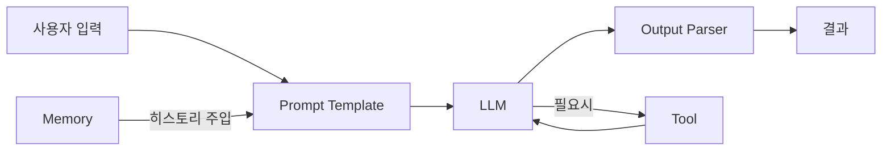

# LangChain — 한눈에 보기

> **한 줄 요약**: LLM의 한계를 극복하고 복잡한 AI 앱을 레고처럼 조립할 수 있게 해주는 파이썬 프레임워크

## LLM의 3가지 한계와 LangChain의 해결책

| LLM 한계 | LangChain 해결책 |
|----------|----------------|
| 대화를 기억 못 함 | Memory |
| 최신 정보가 없음 | Tool (검색) |
| 행동을 못 함 | Agent |

## 핵심 블록 5가지

| 블록 | 역할 | 비유 |
|------|------|------|
| Prompt Template | 입력을 LLM에 맞게 포맷팅 | 편지 양식 |
| LLM | 실제 AI 모델 호출 | 두뇌 |
| Output Parser | 결과를 원하는 형태로 변환 | 번역가 |
| Memory | 대화 기록 관리 | 메모장 |
| Agent & Tool | LLM이 스스로 도구 선택 | 손발 |

## 전체 흐름


## 핵심 문법 — LCEL
```python
chain = prompt | llm | output_parser
result = chain.invoke({"topic": "RAG"})
```

`|` 기호로 블록을 연결하는 게 전부예요.

---
📖 [상세 정리 보기](./deep-dive.md)
