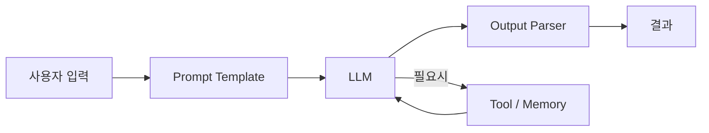

# LangChain — 한눈에 보기

> **한 줄 요약**: LLM을 레고 블록처럼 조립해서 복잡한 AI 앱을 만드는 파이썬 프레임워크

## 핵심 블록 4가지

| 블록 | 역할 | 비유 |
|------|------|------|
| Prompt Template | 입력을 LLM에 맞게 포맷팅 | 편지 양식 |
| LLM | 실제 AI 모델 호출 (GPT, Claude 등) | 두뇌 |
| Output Parser | 결과를 원하는 형태로 변환 | 번역가 |
| Tool / Memory | 외부 검색, 대화 기억 등 확장 | 손발 + 메모장 |

## 데이터 흐름


## 언제 쓰나?

- 내 PDF/DB를 LLM에 연결하고 싶을 때 → RAG
- LLM이 스스로 도구를 선택하게 하고 싶을 때 → Agent
- 여러 LLM 호출을 순서대로 실행하고 싶을 때 → Chain

## 설치
```bash
pip install langchain langchain-openai
```

## 최소 예제
```python
from langchain_openai import ChatOpenAI
from langchain_core.prompts import ChatPromptTemplate
from langchain_core.output_parsers import StrOutputParser

llm = ChatOpenAI(model="gpt-4o-mini")
prompt = ChatPromptTemplate.from_template("{topic}을 한 문장으로 설명해줘")
chain = prompt | llm | StrOutputParser()

result = chain.invoke({"topic": "RAG"})
print(result)
```

---
📖 [상세 정리 보기](./deep-dive.md)
